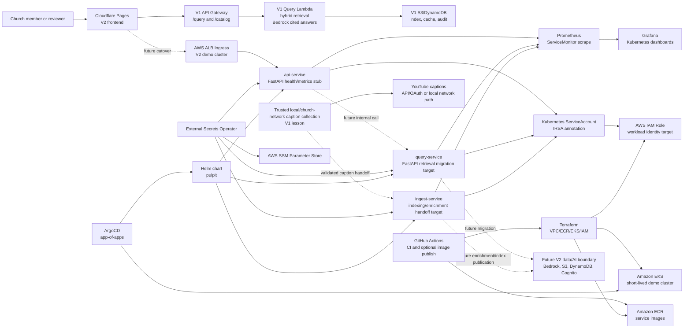

# Pulpit V2 Architecture

## Overview

Pulpit V2 is the platform-engineering migration path for the working Pulpit V1 serverless sermon search product. V1 proved the query behavior and low-idle AWS architecture. V2 proves the Kubernetes platform boundary: EKS, Helm, ArgoCD, tenant namespaces, External Secrets, IRSA-ready service accounts, ALB ingress, Prometheus, Grafana, CI validation, and teardown.

The current V2 query path is deliberately bridged: the live V2 Cloudflare frontend calls the existing V1 API Gateway `/query` and `/catalog` endpoints while V1 retrieval behavior is migrated into `services/query-service`.

## Current State

Implemented or validated:

- Terraform modules for VPC, ECR, EKS, managed node group, and GitHub Actions OIDC.
- Helm chart for `api-service`, `query-service`, and `ingest-service`.
- tenant values for `bethel-atlanta` and `demo-church`.
- ArgoCD root and child applications.
- namespaces, ResourceQuotas, and LimitRanges.
- ExternalSecret resources wired to an SSM-backed ClusterSecretStore.
- IRSA-compatible service account annotations.
- ALB ingress resources through Kubernetes Ingress.
- ServiceMonitor and PrometheusRule templates.
- Grafana dashboard starter and Kubernetes dashboard validation.
- GitHub Actions workflows for validation, tests, Docker builds, and optional ECR publish.
- V2 frontend bridge to V1 API Gateway query/catalog endpoints.

Not yet implemented:

- V1-equivalent retrieval inside V2 `query-service`.
- Cognito JWT verification inside V2 `api-service`.
- a production V2 ingest strategy for YouTube captions.
- automated add-on installation for ArgoCD, External Secrets Operator, AWS Load Balancer Controller, and kube-prometheus-stack.
- committed curated screenshots for public verification.

## C4-Style Container Diagram

## Runtime Flow

### Current live query flow

1. A user opens `https://pulpit-v2.pages.dev`.
2. The V2 static frontend calls the V1 API Gateway query/catalog URLs configured in `frontend-alternative/index.html`.
3. V1 Cognito/API Gateway/Lambda handle auth, retrieval, answer generation, source snippets, cache, and audit behavior.
4. The V2 frontend renders cited answers and source cards while the V2 platform migration continues.

This preserves the proven product path while V2 replaces the runtime incrementally.

### Target V2 query flow

1. The V2 frontend sends authenticated requests to the V2 ALB ingress.
2. `api-service` verifies Cognito JWTs, resolves tenant context, and forwards to `query-service`.
3. `query-service` performs V1-equivalent hybrid retrieval:
   - bilingual query planning
   - semantic and BM25-style lexical retrieval
   - synonym/crosswalk expansion
   - Korean token/morphology handling
   - source snippet selection
   - reranking
   - answer-cache invalidation tied to the active index version
4. Bedrock generates cited answers.
5. DynamoDB/S3-backed cache, audit, and index state preserve the V1 behavior or an explicitly approved successor.
6. Prometheus and Grafana expose both platform and domain metrics.

### Target ingest flow

V1 discovered that YouTube transcript scraping is unreliable from AWS IP ranges. V2 must not assume that an EKS CronJob fixes this.

Credible options:

- trusted local/church-network caption collection, followed by platform-side validation, enrichment, embeddings, and index publication, or
- official YouTube captions API access using OAuth consent from the channel owner.

Until the OAuth captions path exists, the EKS `ingest-service` should be framed as the indexing/enrichment/tenant handoff layer.

## Deployment Shape

The deployment is split by ownership boundary:

- `terraform/` owns AWS platform infrastructure: VPC, subnets, ECR, EKS, managed node group, and GitHub OIDC role.
- cluster add-ons are installed after cluster creation: AWS Load Balancer Controller, ArgoCD, External Secrets Operator, and kube-prometheus-stack.
- `manifests/argocd/` owns GitOps bootstrap and child applications.
- `helm/pulpit/` owns application workloads and tenant-specific values.
- `frontend-alternative/` owns the V2 static frontend and currently bridges to V1 API Gateway.
- `helm/observability/` holds the starter Grafana dashboard artifact.

The intended EKS environment is short-lived and evidence-oriented. The low-idle production query path remains V1 until V2 cutover criteria are met.

## AWS And Service Boundaries

| Boundary | Current role |
|---|---|
| Cloudflare Pages | Live V2 frontend and current V1 API bridge |
| V1 API Gateway/Lambda | Current authenticated query/catalog/retrieval path |
| VPC/subnets | Terraform-created network for EKS and ALB placement |
| EKS | Kubernetes control plane and managed node group for V2 workloads |
| ECR | Service image repositories for `api-service`, `query-service`, and `ingest-service` |
| IAM/OIDC | GitHub Actions OIDC role and IRSA-compatible workload identity shape |
| ALB | Internet-facing ingress target through AWS Load Balancer Controller |
| SSM Parameter Store | Expected source for tenant runtime configuration through External Secrets |
| Bedrock/S3/DynamoDB/Cognito | Proven in V1; target V2 service boundary after migration |

## Data Flow

Current V2 platform data flow:

1. Helm values and Kubernetes manifests define tenant workload desired state.
2. External Secrets syncs tenant runtime config from SSM into Kubernetes Secrets.
3. Services expose health/readiness/metrics.
4. Prometheus scrapes service and cluster metrics.
5. Grafana displays platform metrics.
6. The live V2 frontend calls V1 API Gateway for real query/catalog data.

Target V2 product data flow:

1. Caption collection enters through a trusted local/church-network handoff or official YouTube OAuth captions API.
2. `ingest-service` validates, enriches, chunks, embeds, and publishes tenant indexes.
3. `query-service` loads the active tenant index, retrieves evidence, reranks, and returns cited sources.
4. `api-service` enforces auth and tenant authorization.
5. cache/audit/index markers preserve V1 invalidation and accountability behavior.

## Auth Flow

Current live query auth is handled by V1 Cognito and API Gateway.

Target V2 auth:

1. The frontend obtains a Cognito token.
2. `api-service` verifies the JWT against Cognito JWKS.
3. `api-service` checks tenant and admin authorization before forwarding requests.
4. Workloads use IRSA for AWS access instead of embedded AWS keys.

## CI/CD Flow

1. Pull requests touching `terraform/`, `helm/`, `manifests/`, or platform workflow files run platform validation.
2. Pull requests touching `services/` run service tests and Docker builds.
3. Optional image publishing to ECR is gated behind repository variables and GitHub OIDC.
4. ArgoCD consumes this repository as the source of truth for cluster-side deployment.

## Key Constraints

- EKS resources exceed the low-idle cost guardrail if left running.
- V2 cannot cut over until retrieval quality matches V1 acceptance criteria.
- YouTube caption scraping from AWS IP ranges is unreliable.
- External Secrets, IRSA, Prometheus, and ArgoCD are modeled in repo, but add-on installation remains an operational step.
- Public worker nodes and open EKS endpoint access were acceptable for the demo profile, not the desired production posture.
- Documentation must distinguish validated platform behavior from pending product migration.
