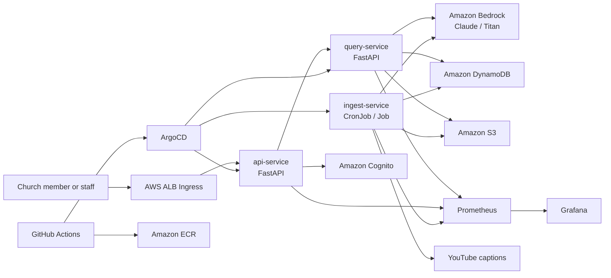

# Pulpit V2 Architecture

## Overview

Pulpit V2 re-architects the original serverless sermon search system into a multi-tenant Kubernetes platform. The goal is not to replace V1 immediately in production. The goal is to demonstrate platform engineering, observability, GitOps, and containerized service design on a real workload.

## C4-style Container Diagram

## Namespaces

Expected tenant model:

- `bethel-atlanta`
- `demo-church`

Shared platform namespaces:

- `argocd`
- `observability`
- `external-secrets`
- `ingress-system`

Runtime secret shape:

- tenant apps use Kubernetes `ServiceAccount` annotations for IRSA
- runtime configuration is synchronized from AWS SSM or Secrets Manager through `ExternalSecret` resources
- app pods consume the resulting Kubernetes Secret as environment variables

## Runtime Model

### Query path

1. User sends a request through ALB ingress.
2. `api-service` authenticates and resolves tenant context.
3. `query-service` performs retrieval against indexed sermon data.
4. `query-service` calls Bedrock for answer generation.
5. Metrics are exported for latency, request volume, and model usage.
6. Prometheus scrapes service metrics through `ServiceMonitor` resources, and Grafana visualizes tenant-level behavior.

### Ingest path

1. `ingest-service` runs on schedule per tenant.
2. It fetches YouTube captions, transforms sermons, and generates embeddings.
3. Indexed data is written to DynamoDB and/or S3 depending on the storage design used during implementation.
4. Metrics are emitted for ingest count, failures, and cost attribution.

## Key Decisions

- Use a **separate repo** from V1 to keep the platform story isolated.
- Use **EKS** because the portfolio goal is Kubernetes/DevOps credibility, not lowest cost.
- Keep **tenant visibility** first-class in dashboards and metrics.
- Treat **V1 code as migration reference**, not production dependency.
- Model GitOps explicitly in-repo:
  - raw namespace and quota manifests live under `manifests/`
  - tenant workload releases live in the `helm/pulpit` chart
  - ArgoCD child applications connect the two

## Constraints

- EKS should be easy to destroy after demos to control cost.
- Bedrock cost attribution must happen at the app layer, not by Kubernetes namespace alone.
- Kubernetes features must map to real business reasoning, not resume padding.
- The current observability assets are starter artifacts. Prometheus alerts and Grafana dashboards will need to be tightened as the services expose richer domain metrics.
- External Secrets and IRSA are scaffolded at the chart layer, but the backing AWS roles, parameter paths, and secret-store installation still need to be created in-cluster.
