# Deployment Evidence

This page documents a live demo deployment of Pulpit V2 on May 11, 2026. The environment was intentionally short-lived for cost control and was used to prove the current platform layers end to end:

- Amazon EKS control plane
- managed node group on `t3.medium`
- ALB ingress per tenant
- ArgoCD app-of-apps deployment flow
- External Secrets backed by AWS Parameter Store
- Prometheus and Grafana scraping the cluster and tenant services
- Cloudflare Pages frontend calling the live V2 edge

The screenshots below are a curated subset of the full capture set under [`docs/screenshots/v2`](screenshots/v2).

## What this deployment proved

- a real EKS cluster was created and became healthy
- tenant namespaces and workloads were deployed through ArgoCD
- runtime secrets were materialized from AWS-backed `ExternalSecret` resources
- ALBs were created for both tenant entry points
- Prometheus discovered and scraped the tenant services
- Grafana visualized cluster and workload metrics
- the browser-facing app on Cloudflare Pages authenticated and returned cited archive answers

## Frontend and user flow

The browser-facing frontend was served from Cloudflare Pages at [`https://pulpit-v2.pages.dev`](https://pulpit-v2.pages.dev). During this session, the live query path was exercised through the V2 edge, but the answer generation layer was still bridged to the current V1 backend.

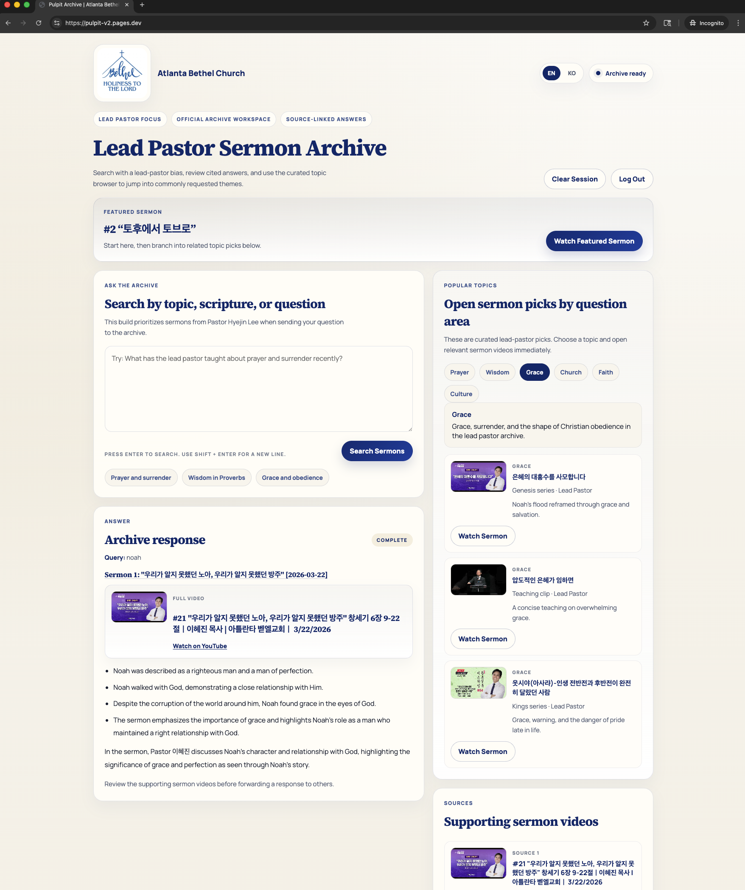

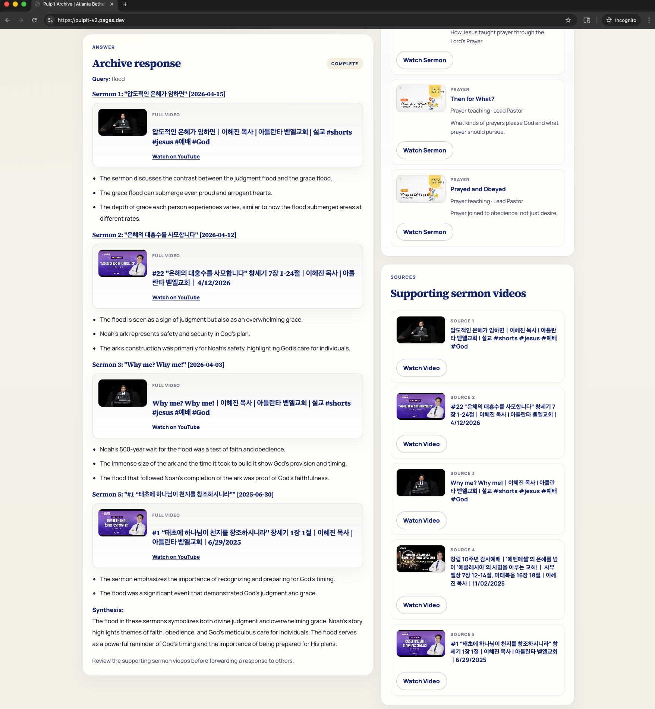

Additional frontend capture:

- [Login screen](screenshots/v2/frontend/login-screen.png)

## AWS and EKS control plane

The EKS control plane, networking, and managed node group were active and healthy during the session.

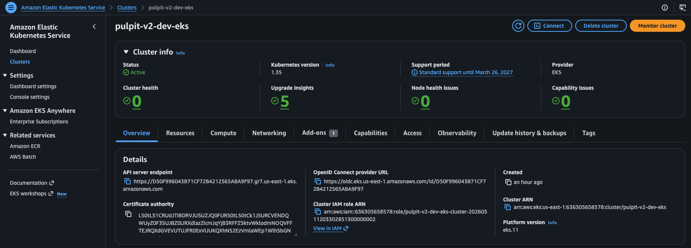

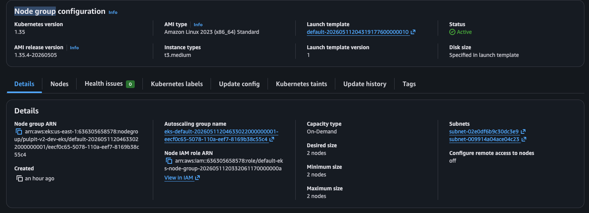

Additional AWS captures:

- [Cluster networking](screenshots/v2/aws/eks-cluster-networking.png)
- [EKS access entries](screenshots/v2/aws/eks-access-entries.png)
- [ALB inventory](screenshots/v2/aws/alb-list.png)
- [Bethel ALB detail](screenshots/v2/aws/alb-bethel-detail.png)
- [Demo church ALB detail](screenshots/v2/aws/alb-demo-detail.png)

## Kubernetes runtime verification

The runtime state was also captured directly from `kubectl`, not only from AWS or ArgoCD UIs.

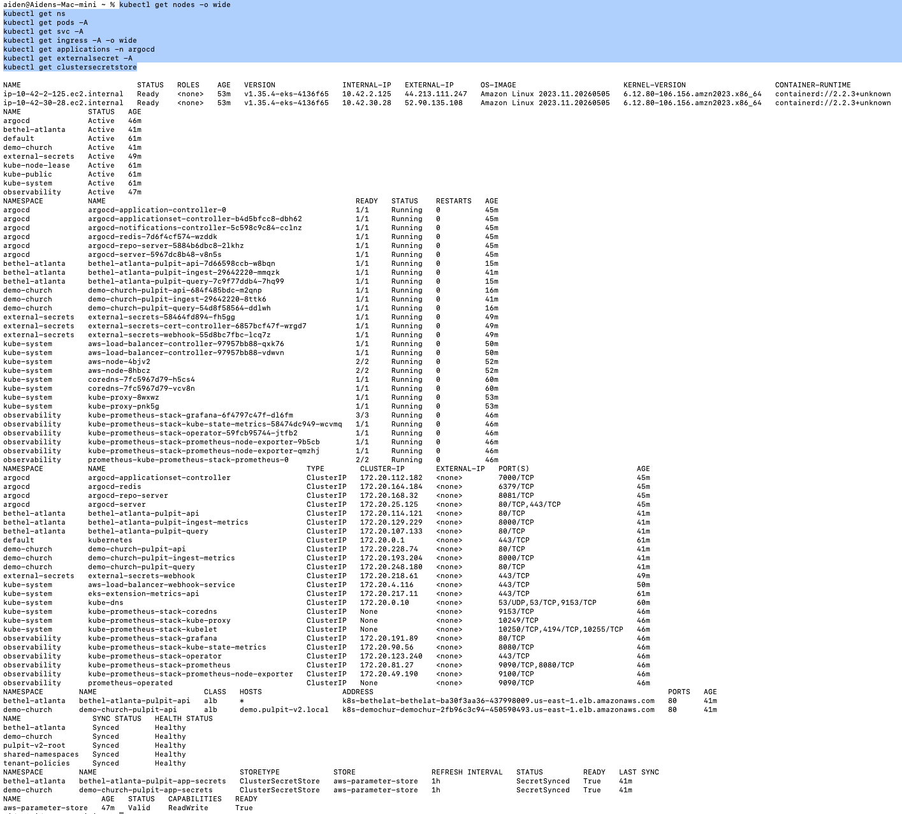

Additional `kubectl` captures:

- [Nodes wide view](screenshots/v2/kubectl/kubectl-get-nodes-wide.png)
- [Pods across all namespaces](screenshots/v2/kubectl/kubectl-get-pods-all.png)
- [Services across all namespaces](screenshots/v2/kubectl/kubectl-get-services-all.png)
- [ArgoCD applications from CLI](screenshots/v2/kubectl/kubectl-get-applications.png)
- [PrometheusRule objects from CLI](screenshots/v2/kubectl/kubectl-get-prometheusrules.png)

## GitOps with ArgoCD

ArgoCD managed the shared namespaces, tenant policies, and both tenant applications through an app-of-apps pattern.

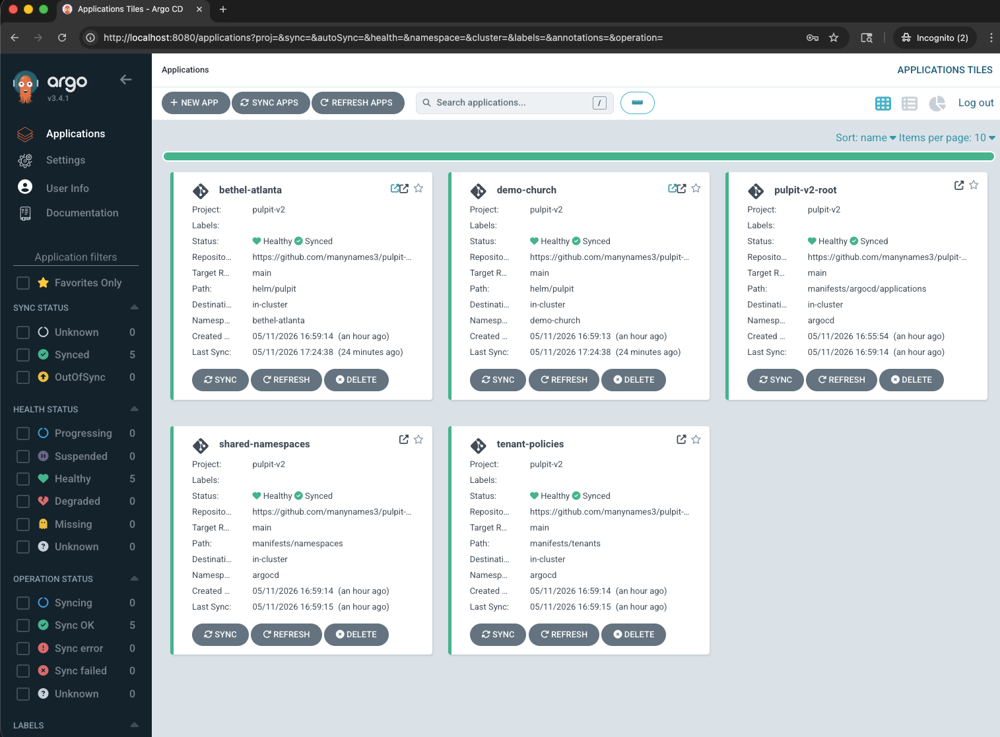

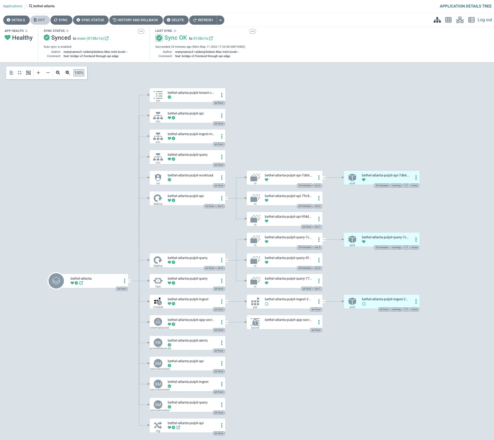

Additional ArgoCD captures:

- [Demo church application tree](screenshots/v2/argocd/argocd-demo-church-application-tree.png)
- [Root application tree](screenshots/v2/argocd/argocd-root-application-tree.png)
- [Shared namespaces application tree](screenshots/v2/argocd/argocd-shared-namespaces-tree.png)
- [Tenant policies application tree](screenshots/v2/argocd/argocd-tenant-policies-tree.png)
- [Cluster connection details](screenshots/v2/argocd/argocd-cluster-connection.png)

## Secret and config delivery

The tenant apps consumed runtime configuration from both a ConfigMap and a Secret generated by `ExternalSecret`. The backing store for the session was AWS Parameter Store through a `ClusterSecretStore`.

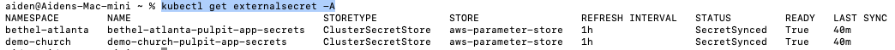

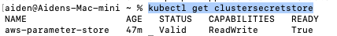

## Observability

The cluster had working Prometheus and Grafana instances, with tenant services visible in Prometheus target discovery and multiple Kubernetes dashboards populated in Grafana.

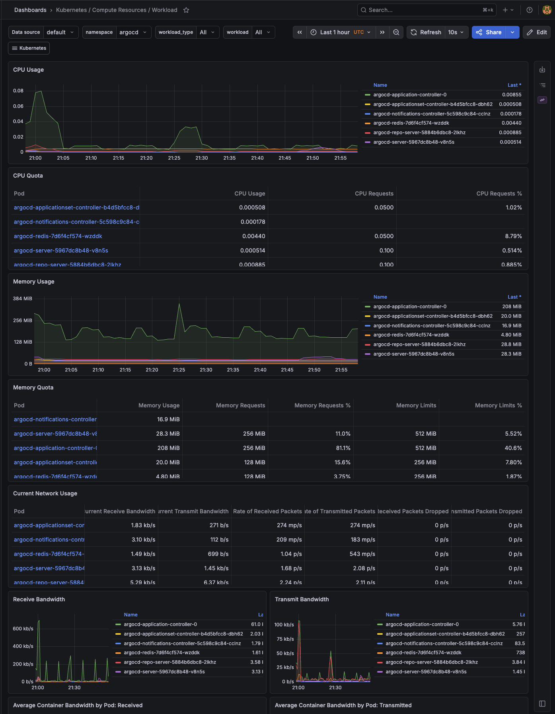

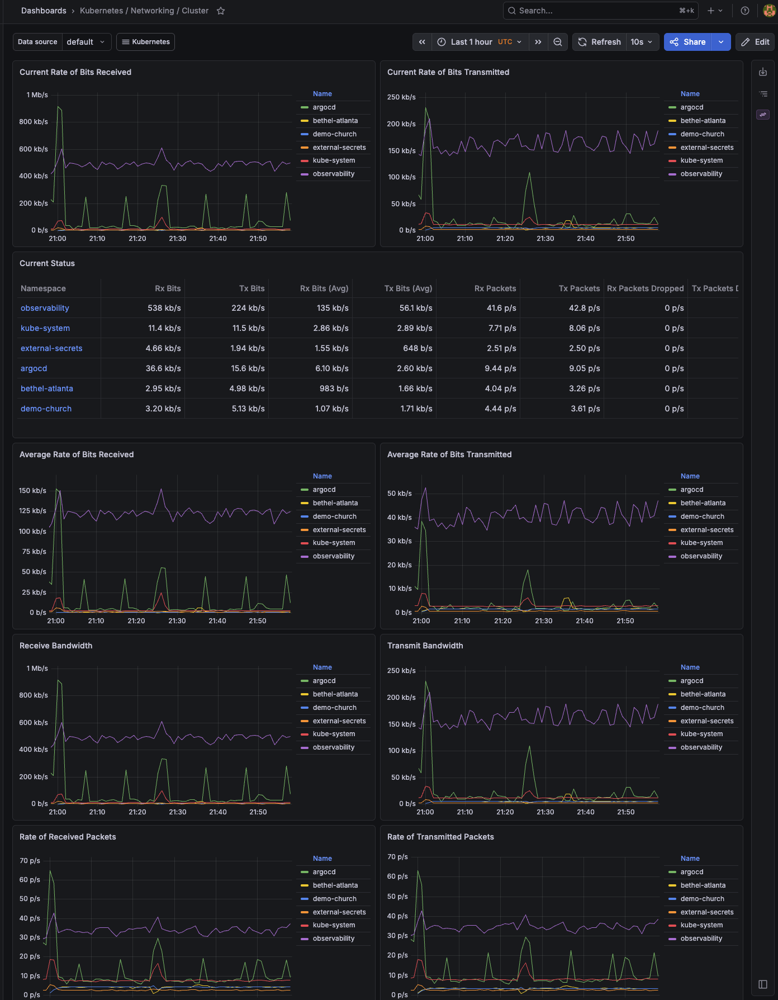

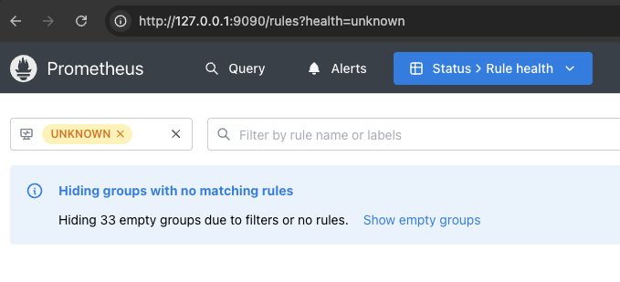

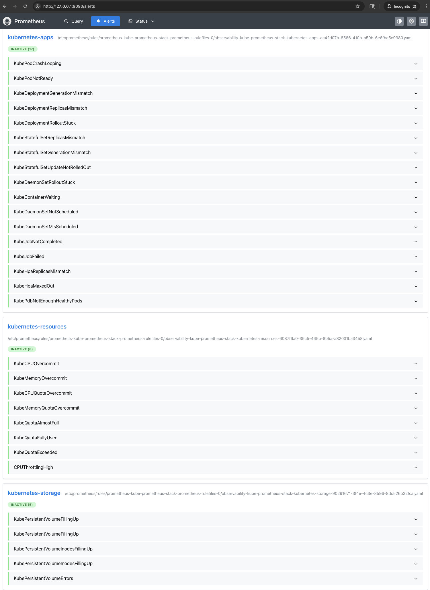

Additional observability captures:

- [Grafana Kubernetes API server dashboard](screenshots/v2/observability/grafana-kubernetes-api-server.png)
- [Grafana ArgoCD namespace workload dashboard](screenshots/v2/observability/grafana-argocd-namespace-workloads.png)
- [Grafana ALB controller pod networking dashboard](screenshots/v2/observability/grafana-alb-controller-pod-networking.png)
- [Grafana node exporter dashboard](screenshots/v2/observability/grafana-node-exporter-nodes.png)
- [Grafana USE method cluster dashboard](screenshots/v2/observability/grafana-use-method-cluster.png)
- [Grafana Prometheus overview dashboard](screenshots/v2/observability/grafana-prometheus-overview.png)
- [Prometheus rule groups](screenshots/v2/observability/prometheus-rule-groups.png)

## Notes on current limitations

- The browser-facing app was real and live, but the query/answer path still used a V2-to-V1 bridge rather than a fully migrated V2 retrieval implementation.
- The custom `Pulpit V2 Overview` Grafana dashboard did not have useful data during this session, so the evidence page uses the working Kubernetes and Prometheus dashboards instead.
- This page intentionally prefers screenshots that prove working infrastructure and runtime state over early auth-flow troubleshooting or empty dashboards.

## Teardown lesson learned

The first `terraform destroy` attempt did not complete cleanly.

Why it failed:

- the EKS cluster and VPC were Terraform-managed
- the tenant ALBs were created indirectly by Kubernetes `Ingress` objects through the AWS Load Balancer Controller
- Terraform attempted to delete the public subnets and internet gateway while ALB-owned ENIs, public IP mappings, target groups, and security groups still existed in the VPC

The visible AWS symptom was `DependencyViolation` on subnet and internet gateway deletion.

The correct teardown sequence for future sessions is now documented in [`runbook.md`](runbook.md):

1. capture final screenshots
2. delete ingress-driven resources first
3. wait for ALBs and target groups to disappear
4. verify the VPC no longer has ALB-owned dependencies
5. run `terraform destroy`

## Still to add after teardown

- `terraform destroy` success screenshot
- optional AWS Console screenshot showing the cluster no longer present
